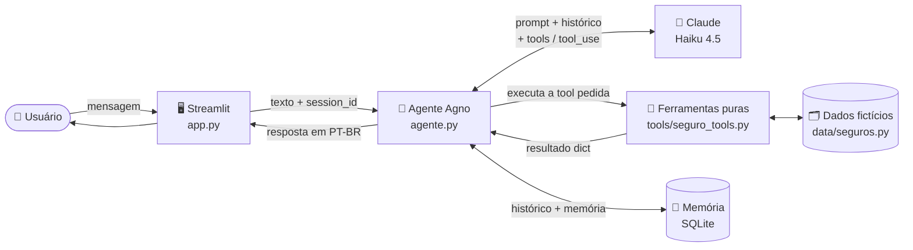

# Assistente de Seguro Auto — Agente de IA


Agente de IA de atendimento de seguro auto: consulta apólices, verifica coberturas,
abre e acompanha sinistros, com **memória conversacional**. Construído em **Python** com
**Claude (Anthropic)** e o framework **Agno**, com interface de chat em **Streamlit**.

## Arquitetura

- `data/seguros.py` — dados fictícios (apólices e sinistros) em memória.
- `tools/seguro_tools.py` — as 4 ferramentas do agente, como **funções Python puras** (sem LLM).
- `prompts/system.py` — persona e regras do agente.
- `agente.py` — o agente **Agno + Claude**, com memória em SQLite. É o coração do projeto.
- `core_demo.py` — o **mesmo loop de tool-calling escrito à mão** com o SDK da Anthropic
  (artefato didático: mostra o que o Agno faz por baixo dos panos).
- `app.py` — interface de chat em Streamlit.
- `tests/` — testes `pytest` das ferramentas e dos dados.

Ideia central: a lógica de negócio (ferramentas) é isolada e testável; o "motor" do agente
apenas a embrulha. Dá para trocar Agno pelo loop cru sem mexer nas ferramentas.

## Fluxo



O `core_demo.py` implementa o mesmo ciclo **Agente ⇄ Claude ⇄ Ferramentas** à mão, com o
SDK da Anthropic, para mostrar o que o Agno faz automaticamente.

## Como rodar

```powershell
python -m venv .venv
.venv\Scripts\Activate.ps1
pip install -r requirements.txt

# configure a chave da API
copy .env.example .env
# edite .env e cole sua ANTHROPIC_API_KEY (https://console.anthropic.com/settings/keys)

# testes
pytest -v

# interface de chat
streamlit run app.py

# demonstração do loop cru do SDK
python core_demo.py
```

## Dados de teste

- **Maria Silva** — CPF `123.456.789-00` — apólice `AUTO-1001` (roubo, colisão, incêndio, terceiros).
- **João Souza** — CPF `987.654.321-00` — apólice `AUTO-1002` (colisão, terceiros — **sem roubo**).
- Sinistro pré-cadastrado: protocolo `SIN-5001`.

## Roteiro da demonstração

1. "Meu CPF é 123.456.789-00, quais são minhas coberturas?" → consulta a apólice.
2. "Meu carro foi roubado, estou coberto?" → responde **sim**, sem pedir o CPF de novo (memória).
3. "Quero abrir o sinistro." → confirma os dados e gera um protocolo.
4. Feche e reabra o app: o agente ainda lembra do cliente (memória persistente em SQLite).
5. Rode `python core_demo.py` para mostrar o loop de tool-calling escrito à mão.

## Como o projeto atende à vaga

- **Python forte** — código limpo, funções puras, testes, separação de responsabilidades.
- **LLMs (Claude)** — integração via Agno e via SDK direto.
- **Prompt engineering** — persona com regras de segurança (não inventar cobertura, confirmar
  antes de abrir sinistro) em `prompts/system.py`.
- **APIs e workflows de IA** — loop de tool-calling (automático no Agno, explícito no `core_demo.py`).
- **Memória e histórico conversacional** — memória de sessão e persistência em SQLite via Agno.
- **Framework desejável (Agno)** — usado como motor do agente.
- **Boas práticas** — segredos em `.env` fora do Git, testes automatizados, documentação.
